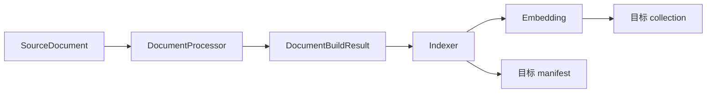
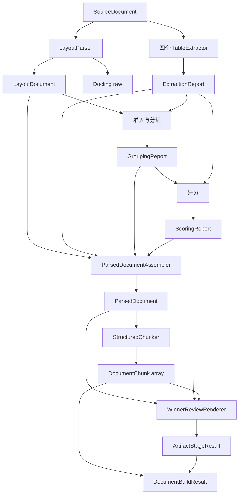
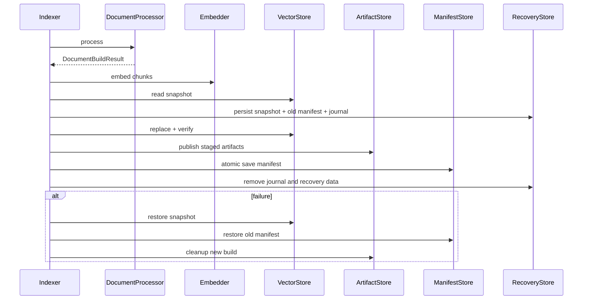

# Minimal RAG 当前系统架构

架构版本：V2.0。更新日期：2026-09-16。状态：已通过编码就绪审查，代码尚未实现。

本文是[当前系统需求](requirements.md)的实现架构。内容按照数据实际流动顺序组织；文档模型、ID 和 JSON 见[数据契约](architecture/v2.0/data-contracts.md)，BuildConfig、manifest、artifact envelope、运行交付和恢复日志见[运行与持久化模型契约](architecture/v2.0/runtime-persistence-models.md)，表格报告字段见[表格领域模型契约](architecture/v2.0/table-domain-models.md)，Docling 适配见[Docling 映射规格](architecture/v2.0/docling-mapping.md)，跨存储一致性见[发布契约](architecture/v2.0/index-publication.md)，CLI、健康检查和错误枚举见[运行时契约](architecture/v2.0/runtime-contracts.md)。

本文中的短代码块用于说明模型在主链中的位置；字段级定义以链接的子契约为唯一权威来源。

## 1. 系统边界

| pipeline | DocumentProcessor | collection | manifest |
| --- | --- | --- | --- |
| v1 | PyMuPDF 按页文本和原递归字符分块 | `minimal_rag_documents_v1` | `.rag/manifest.v1.json` |
| v2 | Docling 版面、四工具表格、结构分块 | `minimal_rag_documents_v2` | `.rag/manifest.v2.json` |

两条链路共享 `.rag/chroma`，但构建、查询、健康检查和恢复均以 pipeline 为边界。legacy `minimal_rag_documents`、`.rag/manifest.json` 不参与运行。RAG 不依赖 `experiments/` 的代码、配置、产物或文档。

## 2. 唯一数据主链

### 2.1 公共主链



`DocumentProcessor` 和 `DocumentBuildResult` 是文档处理与索引之间唯一的公共边界。Indexer 不理解 Docling、表头或评分模型。

### 2.2 v2 内部主链



不存在“先生成不完整 ParsedDocument，再修改它”。Assembler 在构造 TableNode 时依次选择 winner/fallback、判定表头、文本化，最后一次性生成不可变节点。

### 2.3 阶段契约

| 阶段 | 输入 | 输出 | 消费者 | 默认持久化 |
| --- | --- | --- | --- | --- |
| Docling 映射 | SourceDocument | LayoutDocument | 准入、Assembler | 只保存 raw JSON |
| 四工具提取 | SourceDocument | ExtractionReport | 准入、评分、Assembler | 最小选择摘要 |
| 准入分组 | LayoutDocument、ExtractionReport | GroupingReport | 评分、Assembler | 选择摘要 |
| 评分 | GroupingReport、候选、PDF words | ScoringReport | Assembler、审核 | 选择摘要 |
| 文档组装 | 上述事实与决策 | ParsedDocument | Chunker、审核 | `parsed-document.json` |
| 分块 | ParsedDocument | DocumentChunk[] | 审核、构建结果 | `chunks.json` |
| 文档交付 | chunks、统计、staged 产物 | DocumentBuildResult | Indexer | 不整体保存 |

## 3. 数据模型的定位

模型分为四类，禁止跨阶段混入结论：

| 类型 | 含义 | 模型 |
| --- | --- | --- |
| 输入事实 | 工具实际看到的内容 | SourceDocument、LayoutDocument、TableCandidate |
| 决策证据 | 系统如何得到选择 | GroupingReport、ScoringReport、HeaderDecision |
| 文档语义 | PDF 最终被解析成什么 | ParsedDocument 及其 nodes |
| 索引交付 | Indexer 最终得到什么 | DocumentChunk、DocumentBuildResult |

### 3.1 LayoutDocument

```python
class LayoutDocument:
    document_id: str
    page_count: int
    elements: tuple[LayoutElement, ...]
    table_slots: tuple[TableSlot, ...]
    warnings: tuple[ProcessingWarning, ...]

LayoutElement = LayoutText | LayoutList | LayoutTablePlaceholder
```

它是 Docling SDK 模型映射后的 RAG 事实：保留阅读顺序和 table 占位，但没有 winner、表头和 embedding 文本。图片不进入 elements；独立 caption 作为文字保留。

### 3.2 表格事实和决策

```text
TableCandidate[] + TableSlot[]
  → GroupingReport
     ├─ CandidateAdmissionResult[]
     ├─ SlotMatchEvaluation[]
     └─ TableGroup[]
  → ScoringReport
     └─ GroupScoringResult[] → selected_candidate_id
```

TableCandidate 保存物理 cells、跨度、regions、网格和来源。GroupingReport 只决定候选归属；ScoringReport 不能修改候选或组成员。完整阈值、指标和原因见[表格提取与选优需求](requirements/v2.0/table-extraction-selection.md)。

### 3.3 ParsedDocument

```python
class ParsedDocument:
    schema_version: Literal["parsed_document_v1"]
    document_id: str
    document_name: str
    relative_path: str
    file_hash: str
    nodes: tuple[TextNode | ListNode | TableNode, ...]
    warnings: tuple[ProcessingWarning, ...]
```

`nodes` 是下游唯一阅读顺序。

- TextNode：kind、原文、Docling ref、多页来源。
- ListNode：同一列表组的有序 ListItem；保存 level、parent_item_id 和来源。
- TableNode：slot、来源类型、StructuredTable、HeaderDecision、SerializedTable 和来源。

```python
class TableNode:
    node_id: str
    slot_id: str
    docling_ref: str
    origin: Literal["selected_winner", "docling_native_fallback"]
    table: StructuredTable
    selection_ref: str | None
    header: HeaderDecision
    serialized: SerializedTable
    sources: tuple[PageSpan, ...]
```

ready group 使用 winner 并带 selection_ref；unresolved group 使用对应 Docling 原生表格且 selection_ref=None。fallback 不冒充 winner。一个 placeholder 恰好生成一个 TableNode，原表格文字不再重复为 TextNode。

### 3.4 HeaderDecision 与 SerializedTable

HeaderDecision.outcome 为 `identified|undetermined`；reason 全集为 `invalid_grid|unplaced_content|no_candidate_region|no_supported_candidate|ambiguous_candidates|unique_supported_candidate`。候选结论为 `structural_rejection|no_type_transition|supported`。

SerializedTable 保存完整 text 及有来源的 lines。text 必须由 lines 顺序连接得到；chunker 使用 line 的行/cell 边界，不能解析字符串猜结构或重判表头。

### 3.5 DocumentChunk

```python
class V1DocumentChunk:
    # 与现有 TextChunk 完全一致
    ...

class V2DocumentChunk:
    chunk_id: str
    document_id: str
    pipeline_id: Literal["v2"]
    chunk_index: int
    kind: Literal["text", "list", "table"]
    text: str
    token_count: int
    sources: tuple[ChunkSource, ...]
    parent_unit_id: str | None
    fragment_index: int
    fragment_count: int

DocumentChunk = V1DocumentChunk | V2DocumentChunk
```

V1DocumentChunk 保持现有 page-bounded TextChunk 字段、ID 和 metadata。V2 的 text 是 embedding 和 LLM 共用正文，不含 E5 技术前缀；token_count 包含 `passage: ` 和 special tokens 后的真实长度。ChunkSource 保存 node、PageSpan、原文范围及 repeated_context。

### 3.6 DocumentBuildResult

```python
class DocumentBuildResult:
    source: SourceDocument
    pipeline_id: Literal["v1", "v2"]
    build_id: str
    chunks: tuple[DocumentChunk, ...]
    stats: DocumentBuildStats
    artifact_stage: ArtifactStageResult | None
```

| | ParsedDocument | DocumentBuildResult |
| --- | --- | --- |
| 表达 | PDF 语义结构 | 可发布的索引 payload |
| 生产者 | v2 Assembler | v1/v2 Processor |
| 消费者 | Chunker、审核器 | Indexer |
| nodes | 有 | 无 |
| 最终 chunks | 无 | 有 |
| build/统计/staged 产物 | 无 | 有 |
| 持久化 | v2 JSON | 不整体保存 |

v1 artifact_stage=None；v2 必须提供已完整校验但尚未发布的 staged 产物。

## 4. PipelineRuntime 和 DocumentProcessor

```python
class PipelineRuntime:
    pipeline_id: Literal["v1", "v2"]
    collection_name: str
    manifest_path: Path
    build_config: BuildConfig
    document_processor: DocumentProcessor

class DocumentProcessor(Protocol):
    def process(self, source: SourceDocument, build_id: str) -> DocumentBuildResult: ...
```

PipelineRuntime 让 CLI、Indexer、Retriever、健康检查使用同一套链路身份和依赖。BuildConfig 是可序列化、可比较的规则事实；DocumentProcessor 是可执行对象，不能稳定写入 manifest。两者分开后，只有影响结果的 BuildConfig 变化才触发重建，普通代码重构不会误报。

BuildConfig 记录 parser、表格规则、表头/文本化版本、chunker、tokenizer 和 embedding。canonical JSON 的 SHA-256 作为 fingerprint。top_k、Prompt、LLM、日志、HTML 样式和诊断开关不进入 fingerprint。

V1DocumentProcessor 包装现有 parse_pdf/chunk_pages，保持分块正文和边界。V2DocumentProcessor 编排第 2.2 节流程。Indexer 不写 pipeline 分支来操作内部阶段。

## 5. 新增代码的分层

| 层 | 职责 | 禁止 |
| --- | --- | --- |
| domain | 几何、准入、评分、表头、文本化、分块规则 | 文件、CLI、第三方 SDK |
| application | ProcessV2Document 和阶段顺序 | 创建 SDK、决定阈值 |
| infrastructure | 工具适配、Docling 映射、tokenizer、产物存储 | 重算领域规则 |
| presentation | winner HTML、诊断视图 | 重做评分/表头/chunk |

```text
rag/document_processing/
├─ bootstrap.py
├─ domain/{tables,admission,grouping,scoring,headers,serialization,parsed_document,chunking}.py
├─ application/{ports,models,table_selection,process_document}.py
├─ infrastructure/
│  ├─ extractors/{pymupdf,camelot,docling,unstructured}/
│  ├─ docling/{document_parser,mapper}.py
│  ├─ pdf/{coordinates,pages,words}.py
│  ├─ tokenizer.py
│  └─ artifacts.py
└─ presentation/{winner_review,diagnostics}.py
```

bootstrap 只装配依赖；ProcessV2Document 才编排流程。本次不全面重构现有向量库、LLM、Prompt 和 CLI。

## 6. 状态与融合

TableSlot 为 eligible/deferred；CandidateView 为 comparable/deferred；CandidateAdmissionResult 为 completed/deferred，decision 为 admitted/rejected；TableGroup 为 ready_for_scoring/unresolved。原因码必须使用需求中定义的原值，不能另造别名。

Assembler 遍历 LayoutDocument：LayoutText→TextNode，LayoutList→ListNode，TablePlaceholder→查组并选择 winner/fallback→表头判定→文本化→TableNode。缺失来源保留缺失事实，不补造。

整份 Docling 失败则 v2 文档失败，不切换 v1。本版不臆造“部分页面成功”的识别或发布规则；出现可复现真实样例后再扩展模型和流程。

## 7. 结构分块

普通文本和 List 的正文格式、递归分隔符顺序、overlap 选择、父项退化和终止条件由[普通文本、List 文本化与 V2 分块需求](requirements/v2.0/document-text-and-chunking.md)完整定义；本节只说明模块连接。

TokenCounter 与 E5Embedder 使用同一 tokenizer，按真实前缀和 special tokens 计数。

- 连续普通文字在上限内合并，可跨页；单节点超限递归拆。除 title 外，超长文字内部 overlap 上限 32 tokens。
- List 独立成块；超限先按完整项拆，单项才递归拆并使用有限 overlap。
- 表格独立成块；超限依次按完整数据行、物理格、格内自然边界拆。重复必要表头，不重复数据行，表格正文无 overlap。

分块后验证 ID、连续序号、非空、真实 token 上限、node 引用、fragment 完整和原文覆盖；失败不返回 DocumentBuildResult。

## 8. 产物目录

```text
.rag/artifacts/v2/
├─ .staging/<document_id>/<build_id>/
└─ documents/<document_id>/<build_id>/
   ├─ raw/docling-document.json
   ├─ parsed-document.json
   ├─ chunks.json
   ├─ selection-summary.json
   ├─ winner-review.html
   └─ diagnostics/
```

ArtifactStage 在 staging 写完并校验五个必需产物后返回 ArtifactStageResult。只有 Indexer 能 publish。HTML 直接读取实际 HeaderDecision、SerializedTable、chunks 和 ScoringReport；零 winner 也生成，失败阶段为 `winner_review_generation`。

## 9. 索引发布事务



manifest 保存 pipeline、collection、完整 BuildConfig/fingerprint，以及每文档 file_hash、build_id、artifact_path、page/character/chunk count。manifest 原子保存成功是新 build 生效点。任何破坏旧状态的操作先持久化恢复证据；全量 force 先构建验证全部 payload，任一失败不清空目标 collection。完整 journal、prune 隔离和启动恢复规则见[发布契约](architecture/v2.0/index-publication.md)。

## 10. 检索、健康检查和 CLI

向量 metadata 保存 pipeline/build、chunk 类型与序号、页面集合、node IDs、token 数、来源、file/config hash。Retriever 只打开 runtime collection；search/ask/chat 不提供页过滤。`chunks --page` 先按 document_id 读取该文档全部记录，再在应用层保留页面集合包含目标页的 chunk，不执行向量查询或候选过取。引用展示全部来源页。

健康检查依次验证 manifest 身份/schema、config fingerprint、collection 存在性、总数和逐文档 count/build/file hash，再计算 current/new/changed/missing/invalid/unprocessable/unassessed。pipeline 级阻断时使用 unassessed；只读 PDF 预检失败使用 unprocessable；已有记录、向量或 active artifact 不一致使用 invalid。所有修复只针对当前 pipeline。

CLI 顺序为：解析 `--pipeline`（默认 v2）→ Registry 取 runtime → 按命令延迟装配 → readiness → use case。documents 不加载模型，v2 ingest 才加载四工具，ask/chat 再加载 LLM。

## 11. 错误与测试

阶段错误固定包括：`docling_layout_parsing`、`table_extraction`、`parsed_document_fusion`、`table_serialization`、`structured_chunking`、`winner_review_generation`、`embedding_validation`、`index_publication`。页级工具失败保存在执行报告，不自动升级为文档错误。

测试必须覆盖：禁止 rag 导入 experiments；domain 无 SDK；四工具和 Docling mapper 契约；TokenCounter/Embedder 一致；staging/publish/rollback；v1/v2 隔离；完整 v2 产物；各发布阶段故障；legacy 索引不被操作；同输入同配置结果确定。

## 12. 编码前技术验证

以下验证已经完成，证据和环境见[编码前技术验证记录](architecture/v2.0/technical-validation.md)：

1. 已锁定 Docling 2.121.0/docling-core 2.92.0 的节点、列表、表格、caption 和 provenance 字段，并完成真实 PDF 转换。
2. Chroma 1.5.9 已通过 embedding snapshot、空 snapshot、恢复和重启读取，保留 snapshot+journal 架构。
3. E5 tokenizer 已验证前缀、special tokens、512 上限和关闭截断，并固定模型 revision。
4. Windows 同卷 replace/rename 已通过；目录 fsync 不支持、打开 HTML 时清理失败已固化为平台事实。

这些验证只决定适配器实现。mapper fixture、发布故障注入、最终 embedder 一致性和延迟清理属于实现验证，由实施清单继续跟踪；不得据此新增业务语义。
