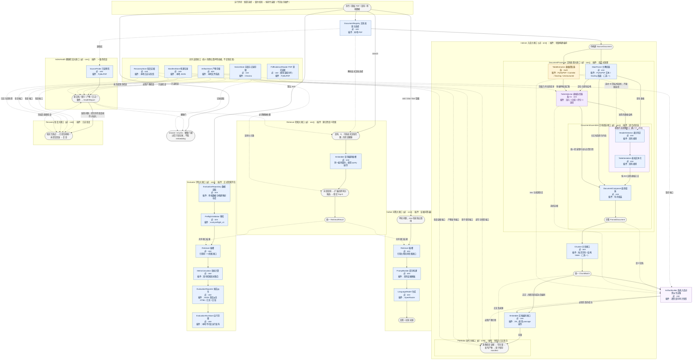
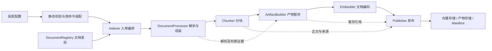

# V3.0 接口体系与端到端总体设计

状态：本文件保留设计推导与早期总览图；面向本轮逐接口审核的视图为[交互式架构审核图](system-architecture-review.html)，正式槽和边以[装配架构契约](spec/architecture/assembly-contracts.md)为权威。返回 [审核入口](README.md)；规格归属见 [文档地图](document-map.md)，历史依据见 [能力盘点](capability-inventory.md)。

## 0. 全系统接口结构总览（早期设计推导）

这张早期图辅助理解接口切分的由来；其灰色动作节点不应作为接口、插件或完整连接表审核。请以[交互式架构审核图](system-architecture-review.html)检查当前接口、端口与插件，以[装配架构契约](spec/architecture/assembly-contracts.md)核对机器可执行的槽和边。**外框表示组合接口，框内矩形表示内部接口；同一接口可以在不同组合中作为插槽使用。** 不再拆小接口的模块直接画为矩形。节点中的“插件”只是当前可绑定实现的摘要，参数不属于接口定义。

- **必 / 选 / 条**：必接、无条件选接、条件接入；**one / multi**：启用后接一个或多个插件。必接相对于所属功能启用而言，浏览命令不需要加载问答插件。
- **实线箭头**：业务输入输出或明确执行先后；链式箭头表示串接，分叉后汇合表示并接。并接不承诺实际并发。
- **虚线箭头**：共享接口的依赖引用或额外输入，不另建第二份实现。虚线不表示选接；选接性质以节点标签为准。
- 灰色圆角节点是输入输出、调用位置或插件内部动作，**不是新增接口**。颜色辅助阅读，所有约束也有文字标注。



### 图中条件与连接的准确含义

| 条件 | 成立时 | 不成立时 |
| --- | --- | --- |
| C1：接入至少一个表格提取插件 | 表格选优器必须接入，汇合主解析与候选结果 | 表格选优器禁止接入，主解析直接交组装器 |
| C2：组装器声明可消费表格结构 | 必须接入表格内容准备接口，其内部表头判定与文本化串接 | 不接该接口；无补充内容时仍经过必接组装器，保持主内容 |

ArtifactBuilder 与 ArtifactStore 对所有入库装配均必接；适用文件集合按实际接入的处理阶段确定，不再存在 C4 条件。纯文本装配也保存主解析原生/公共结果、完整组装和分块快照，不伪造表格阶段文件。

图中有两处容易混淆：

1. **MainParser 与 TableExtractor 是并接，TableSelector 是汇合后的串接。** 多个提取插件占用同一个 multi 插槽，不是每新增工具都新建接口。组装器内部的文本/列表保留和表格准备是按内容类型处理，最终共同形成文档，不改变原始阅读顺序。
2. **Chatbot 和 Evaluator 都使用 Retriever，但不是两套检索实现。** 图中的 Retriever 插槽是使用位置，展开结构只画一次。Embedder 的文档与查询位置同样遵循一个接口，模型身份相同而操作前缀不同。

Publisher、IndexHealth、Recovery 框内的灰色动作不再拆插件，其真实小接口是虚线引用的共享存储和预检端口。恢复后复查属于操作循环，不是构建数据图的循环依赖。评估框展示成功路径，失败记录、报告发布生效点仍受待审核的 D-05 处置约束。

本图是接口与连接的审核视图，第 3—4 节解释相同设计；尚未产生另一份可执行连接配置。后续落地时连接只在接口结构契约中定义一次，由其派生图和上下游导航。

## 1. 系统范围与术语

V3.0 将已有数字 PDF 发现、解析、分块、索引、检索、问答、聊天、评估、审核与恢复能力纳入一个接口与插件体系。功能结果保留，内部运行机制替换；不加载旧版运行实现，不以历史产物驱动正常业务。

接口定义业务契约及内部结构；插槽是组合内部对某个接口的使用位置；插件实现接口；装配配置为插槽绑定具体插件及参数。连接只定义一次，由运行时推导依赖顺序与反向导航。同一个插件在不同位置使用时，位置身份与插件身份分开。

本轮提供纯文本和结构化能力的等价预设，固定名称为 `plain_text`、`structured`，默认选择结构化能力。自定义配置在引导完成校验后由用户命名；名称只用于选择和展示，不充当构建指纹。预设是装配数据，不是硬编码的系统版本或独立执行引擎。未来新增组合不应要求在主流程增加预设名称分支。

V3.0 CLI 不保留 `--pipeline v1|v2`。默认命令使用明确指向的最佳装配配置；`--config NAME` 直接选取已保存配置，`--configure` 进入交互式选择或创建引导。改变默认指向不改变旧索引身份或重解释已有数据；具体配置文件字段由后续架构定义。稳定 ID 中保留的历史文本不承担运行路由。

不增加元数据自动过滤、关键词/混合检索、图片理解、OCR、多轮记忆、阶段缓存恢复、热替换、插件市场或通用工作流编辑器。接口可以独立替换，不意味着本轮已验证所有交叉组合。

## 2. 主链与支撑关系

### 2.1 入库



图中产物暂存是所有入库装配的必需派生阶段：纯文本预设保存其真实解析、组装、分块成果，结构化预设还保存已接入表格阶段的成果；任何适用文件失败均发生在编码和发布之前。Indexer 负责文档范围、增量、force 和 prune 的协调，不理解表格评分公式。

发布始终先准备并验证新数据，再保存恢复证据，最后改变旧状态；manifest 原子保存是生效点。全量 force 必须先完成所有目标文档的新 payload，不以流式逐文档提交替换现有全有或全无语义。

### 2.2 查询与回答

```text
装配配置 → 选定索引上下文 → 只读健康检查
  ├─ browse / chunks → 记录读取与展示（不编码、不读 embedding）
  ├─ search → Retriever → 有序检索结果
  └─ ask / chat → Chatbot
                   └─ Retriever → PromptBuilder → LanguageModel → 回答及引用
```

Retriever 内部也必须调用同一个只读健康检查服务，使直接 API 调用和评估不能绕过检查；CLI 的恢复交互只负责修复授权和再次检查，不复制状态判断。已有显式文档限定仍由 DocumentRegistry 解析为 document_id，属于检索请求的范围，不是新增元数据过滤插件。

chat 是连续调用问答接口的终端会话，固定装配配置，每轮独立检索，不增加记忆接口。API Key 仅在调用 LLM 所需路径中检查，认证重试由交互协调器处理。

### 2.3 评估与恢复

```text
审核通过的 ground truth + 当前构建的 test set
  → 评估前置校验 → 同一个 Retriever → 逐题事实
  → 指标计算 → 不可变运行记录 → JSON 派生 HTML、summary、comparison

源文档事实 + Manifest + 向量 metadata + 必需产物 + 恢复日志
  → IndexHealth → 状态与问题 → 操作建议
  → 经允许的 Recovery / Indexer 操作 → 完整复查 → 原请求
```

默认评估不调用 LLM、不修改索引。`eval --live` 保留为问答冒烟入口，不混入正式检索指标。报告和审核页面始终是派生产物，不反向成为业务证据或标准答案。

## 3. 顶层接口职责

以下是语义模型工作名，不是只凭名称即可编码的模型定义。每个输入输出在后续架构中补齐字段、可空条件、不变量和错误契约。表中的“必接”均相对于使用该能力的组合，不要求 browse 加载整个模型栈。

| 接口 | 输入 → 输出语义 | 首批插件 / 实现职责 | 内部边界与接入规则 |
| --- | --- | --- | --- |
| DocumentRegistry | 受限源目录、选择条件 → SourceDocument 集合或确定文档 | 本地 PDF 发现与安全选择 | 必接 one；扫描、规范路径、hash、歧义检查为一个职责，不额外拆插件 |
| DocumentProcessor | DocumentRequest → ProcessingResult（完整 ParsedDocument 与处理证据） | 组合式文档处理 | 必接 one；主解析、可选表格分支、必接组装，见第 4 节 |
| Chunker | ParsedDocument → ChunkBatch（正文、来源、统计） | 按页递归字符分块；结构化 token 分块 | 必接 one；结构化插件内部按同一 E5 身份计数，不另设计数接口 |
| Embedder | 文档正文批次或查询 → 带编码身份的向量结果 | 锁定 revision 的 E5 | 必接 one；文档/查询为同一接口的明确操作，保持前缀差异；结构化分块计数与其 tokenizer 身份一致 |
| Indexer | 入库范围、源目录、目标构建上下文 → IngestResult | 增量构建编排 | 必接 one；Processor、Chunker、Embedder、Publisher 必接 one；ArtifactBuilder 是系统入库层的必需派生支路，不属于 Indexer 内部插槽 |
| ArtifactBuilder | 各实际执行阶段结果、原生解析证据、最终 chunks、构建身份 → 暂存产物引用 | 逐阶段 JSON 与四类人工审核 HTML | 所有入库装配必接 one；按实际接入阶段决定文件集合，审核视图不重算业务判断 |
| Publisher | 完整新 payload 或 prune 请求、目标索引上下文 → 发布结果 | 日志与快照保护的发布协调 | 必接 one；存储和产物存储端口必接；不得让解析插件直接发布 |
| Retriever | 查询、K、可选显式文档范围、索引上下文 → RetrievalResult | 确定性语义检索 | 必接 one；query Embedder、向量读取与健康检查为必需依赖；不预设混合检索插槽 |
| Chatbot | 单轮问题、索引上下文 → AnswerResult | 有证据约束的问答编排 | 必接 one；Retriever → PromptBuilder → LanguageModel，均 one |
| Evaluator | approved 数据集、映射、查询配置、索引上下文 → EvaluationRun | 正式检索评估编排 | 必接 one；数据仓库、预检器、Retriever、指标计算器、报告与运行发布接口均 one |
| IndexHealth | 源事实及只读存储视图 → HealthReport | 一致性检查 | 必接 one；SourceProbe、存储读取与产物检查按契约依赖；只报告，不修复 |
| Recovery | 已确认的恢复请求、持久化事务证据 → RecoveryResult | 已提交事务收尾或未提交事务回滚 | 发布体系必接 one；不调用解析器当作检查点恢复，不自行 force 覆盖日志 |

DocumentRegistry 不兼任索引状态数据库；Indexer 不兼任解析器；Chatbot 不承担终端交互；Evaluator 不拥有另一套检索算法。大模块插件可以编排小接口，但这些职责不能在多个层次重复实现。

### 3.1 支撑接口与资源

| 支撑接口 | 统一语义及当前实现 | 消费者 / 边界 |
| --- | --- | --- |
| VectorStore | 向量查询、记录读取、写入、计数、快照与恢复；Chroma | Retriever、Publisher、Health；读写操作能力分开，不让 browse 读取 embedding |
| ManifestStore | 构建记录读取、验证与原子保存；本地 JSON | Publisher 是 active build 指针写入者，Health 和查询只读 |
| ArtifactStore | 暂存、发布、隔离、回滚与清理；本地文件系统 | Builder 暂存、Publisher/Recovery 改变发布状态；HTML 不决定数据 |
| RecoveryStore | journal、旧 manifest、向量快照的持久化与校验 | Publisher/Recovery；恢复失败保留证据 |
| SourceProbe | 只读 PDF 可处理性与页数事实；现有 PyMuPDF 预检 | Health；不暗中加载 Docling/Embedding，预检不产生业务文档 |
| PdfEvidenceReader | 页几何及指定区域 words；PyMuPDF | 解析适配和表格评分；统一坐标、单位与缺失表达 |
| PromptBuilder | 问题与命中 → 有序消息；现有证据约束模板 | Chatbot；引用格式为明确配置，禁止根据旧模型类名猜测 |
| LanguageModel | 有序消息与调用参数 → 回答 | OpenRouter；无答案视为服务错误，不自行读取文档 |
| EvaluationRepository | 审核数据及构建映射的严格读取 | Evaluator；不能根据实际排名生成正确答案 |
| PreflightValidator | 审核数据、证据组、来源与构建身份的发布前预检；`eval.preflight_v1` | Evaluator；失败时不得执行正式检索 |
| MetricCalculator | 映射与逐题命中事实 → 逐题及聚合指标 | 现有 evidence-group/相关 chunk 指标集合；不逐公式拆插件 |
| EvaluationReporter | 不可变运行事实 → 各类报告 | 同一报告包接口；不重做检索或修改原始事实 |
| EvaluationRunStore | 运行暂存、完整性确认、不可变发布 | Evaluator；与索引事务是不同作用域 |

这些接口可使用内置插件，只有一个实现也无需制造第二个实现。模型、ID 函数、枚举、纯校验和业务算法内部辅助函数不因“插件化”而各自成为插件。CLI、装配器和生命周期管理属于系统外壳，不设可绕过契约的插件开关。

## 4. DocumentProcessor 的内部设计

### 4.1 插槽与方向

| 内部接口 | 接入规则 | 数量 | 输入 → 输出 | 当前插件 |
| --- | --- | --- | --- | --- |
| MainParser | 必接 | one | 源 PDF → PrimaryDocument（有序内容事实、定位、原生结构、来源） | PyMuPDF 按页文本；Docling 版面 |
| TableExtractor | 无条件选接，仍须满足兼容性 | multi | 源 PDF → TableExtractionReport | PyMuPDF、Camelot、Docling、Unstructured，策略为插件内部配置 |
| TableSelector | 提取分支接入则必须接，否则禁止 | one | 主解析定位与原生内容、候选报告集合、PDF 原文证据 → ContentResolution 集合及决策证据 | 现有准入、分组、四指标评分、选优与原生回退判定 |
| DocumentAssembler | 必接 | one | PrimaryDocument、可缺席的 ContentResolution 集合 → 完整 ParsedDocument | 条件 TableContentPreparation（HeaderDetector → TableSerializer）与必接 DocumentComposer（有序组装） |

连接的权威表达只采用下列边表；反向关系由边表推导，不另维护上游/下游字段：

| 来源 | 目标 | 传递内容 |
| --- | --- | --- |
| Processor 输入 | MainParser、TableExtractor | 同一源 PDF 身份及读取请求 |
| MainParser | TableSelector | 可用于准入的定位与主解析原生内容 |
| TableExtractor 集合 | TableSelector | 按已定义工具/策略顺序收集的候选与执行事实 |
| Processor 的 PDF 证据依赖 | TableSelector | 指定区域词与页面几何，支撑现有评分参照 |
| MainParser | DocumentComposer；C2 时亦供 HeaderDetector | 主文档阅读顺序及原生表格结构 |
| TableSelector | DocumentComposer；C1∧C2 时亦供 HeaderDetector | 最终采用内容及决策引用 |
| TableContentPreparation | DocumentComposer | 按 slot 关联的表头判定和最终表格文本 |
| DocumentComposer | DocumentAssembler | 完整 ParsedDocument |
| DocumentAssembler | Processor 输出 | 完整不可变语义文档 |

无提取分支时，组装器保留主解析的内容、顺序和来源，不新增正文修饰；不将“分支未接入”表示为一次成功零表执行。提取分支有结果但没有 winner 时，保留原生回退事实，不能把表格删除或伪称 winner。

### 4.2 表头与文本化的位置

选优处理的是采用哪个结构，不在通用组装连接层计算评分。组装器按照统一节点类型完成文档组装；对于最终采用的表格结构，调用内部表格内容准备接口：表头判定 → 规则文本化 → 完整表格节点。

表格内容准备接口下，HeaderDetector 和 TableSerializer 均必接 one，当前分别为已有表头规则与文本化规则。此接口在组装器被装配为可消费表格结构时必须存在，普通文本能力不需要它；依据声明能力校验，而不是预设名称判断。winner 与原生回退经过同一准备过程，规则不重复定义；文本化的输入包含最终 node ID，避免改动已有正文中的定位字符串。

组装器不识别具体提取工具；仅消费公共结构与选择证据。其对文本、列表和表格的处理是稳定领域类型处理，不是根据插件名称写分支。列表父子关系和表格单元格结构不能为了接口统一而压平。

### 4.3 资源依赖与执行

逻辑上的主解析与提取分支可并接，不要求并发。现有 Docling 表格候选直接来自同一次主文档转换；新设计由 Docling 适配器族共享文档级、配置一致的转换资源，通过依赖注入提供，避免重复模型推理和不一致 raw。

SDK 对象只在该适配器族内部使用，不进入 PrimaryDocument 或 TableExtractionReport；共享资源由装配层创建、按源 hash 和转换配置核对、在本次文档处理后释放。它不是阶段缓存、全局可变单例或从历史产物恢复。若共享结果/异常传播无法证明保持既有语义，先做技术验证，不能退而隐式运行两次。

工具各策略及页级失败继续规则保持，报告收集顺序不随线程完成顺序变化。某个提取工具页失败与主解析整体失败分别处理，Docling 整文失败不改用纯文本插件重试。

## 5. 公共模型语义边界

| 模型族 | 创建者 → 消费者 | 必须保留的语义 / 不允许的混入 |
| --- | --- | --- |
| SourceDocument | Registry → Processor、Health、构建 | 文档身份、相对路径、内容 hash；不带索引健康结论 |
| PrimaryDocument | MainParser → Selector、Assembler | 阅读顺序、内容、局部定位与原生结构；纯文本以实际页边界表达，不伪造结构 |
| TableExtractionReport | 提取插件 → Selector | 候选结构、来源、策略、执行事实；统一各工具表示，不包含 winner |
| ContentResolution | Selector → Assembler | 目标位置、采用内容、来源与决策引用；外层不为每种工具增加字段；内容使用明确领域类型 |
| ParsedDocument | Assembler → Chunker、审核 | 完整语义节点；组装完成后不再被下游原地追加判断 |
| ChunkBatch / Chunk | Chunker → Embedder、审核、发布 | 正文、顺序、全部来源、重复上下文、稳定标识及真实可得统计；不使用旧版本判别联合 |
| ProcessingEvidence | 各阶段 → 审核与诊断 | 事实和判断记录，以类型和引用组织；不作为下游重新选优的入口 |
| PassageEmbeddingBatch / QueryEmbedding | Embedder → Publisher / Retriever | 入库批次保留 chunk 顺序、身份和向量；查询向量单独建模；不能只凭维度相同判定兼容。字段权威见[检索问答契约](spec/architecture/retrieval-answering.md)。 |
| RetrievalResult | Retriever → Prompt、评估、展示 | 严格有序候选、正文、来源、距离与分数语义；不塞入标准答案 |
| AnswerResult | Chatbot → 终端 | 回答、实际证据和请求消息；凭据不进入结果 |
| BuildPayload / Manifest / HealthReport | 构建、发布、检查分别创建 | 未发布结果、已生效事实、派生状态分开，不以目录最新时间认定 active |
| EvaluationRun | Evaluator → 报告、比较 | 原问题、映射、实际命中及分子分母；不能用报告回写标注 |

外层统一不要求所有插件都有同样的信息量。纯文本缺失精确 bbox 等信息要有明确缺失条件，不能编造；token_count 是否存在、页内/全局编号如何共存，均由字段级契约明确，不用版本号分流。既有 ID 规则可以是配置策略，但不得改变正文和排序。ID 规格冲突见盘点 D-02。

## 6. 装配、配置与预设

接口定义、插件定义、绑定配置分别存放并独立校验；本轮不批准此前讨论中的任何 YAML 字段作为最终格式。

| 装配位置 | 纯文本等价预设 | 结构化等价预设 |
| --- | --- | --- |
| Registry / SourceProbe | 本地 PDF / PyMuPDF 只读预检 | 相同 |
| MainParser | PyMuPDF 按页原文 | Docling 原有锁定选项 |
| TableExtractor / Selector | 不接 / 不接 | 四工具九策略 / 现有选优规则 |
| Assembler | 必接；无补充内容不改变主解析结果 | 必接；组装并准备最终表格内容 |
| Chunker | 按页递归字符规则 | 结构化 token 规则与现有重复上下文 |
| ArtifactBuilder | 必接；保存主解析原生/公共结果、完整文档、最终 chunks 与逐块审核页 | 必接；再保存表格提取、选优、内容准备及各自审核页，不另设 winner 页 |
| Embedder / VectorStore | E5 / Chroma | 相同插件，不同索引作用域 |
| Retriever | 确定性语义检索 | 相同 |
| PromptBuilder | 保留原单页来源模板 | 保留原多页来源模板，即使某结果只有一页 |
| Chatbot / LanguageModel | 证据问答 / OpenRouter | 相同 |
| Evaluator | 现有正式检索协议 | 相同协议，映射绑定对应构建 |

Prompt 的 `page` 与 `pages` 格式由明确模板配置保留，不能通过统一模型后简单按页数判断，否则会改变已确认的请求构造。字符分块不套用结构分块硬上限重新切块；其长文本与编码行为需在详细规格中核对，不能借统一模型自动“修正”。

装配的静态检查包括：未知插件、接口不匹配、必接缺失、one 多接、条件违背、连接不闭合、缺少 slot 定位能力、tokenizer/embedding 不一致、存储目标越界或错配。通过类型检查但能力不足的组合仍须拒绝。

构建配置记录真正影响内容、来源、向量及持久化的插件、参数与规则；查询 K、Prompt、日志和展示不触发索引重建，但应进入相应运行记录。接口版本、插件实现版本和规则版本职责区分，普通重排代码不应强制重建。新 fingerprint 与旧值不必相同，等价验证比较解析后的语义配置与实际产物，不伪造旧指纹。

命令按需实例化依赖：只读浏览不加载解析器和模型；ingest 才加载提取工具；search 仅加载查询编码；默认 eval 不加载 LLM。启动校验利用轻量描述完成，不能为查插件元数据而执行昂贵解析。

## 7. 失败、存储与扩展边界

Publisher 和 Recovery 共享一套事务契约，任何存储插件替换都必须满足快照、回读、生效点及恢复要求。原子性由协调器保证，不能因“每个插件独立”而让各存储自行提交。必需审核产物失败不得发布；提交后的旧产物清理失败不回滚新构建。

Health 只使用事实和存储回读；恢复建议与执行分离。非交互只读命令不修复；交互确认后执行选定作用域的操作，完成后复查。已提交日志做提交收尾，未提交日志回滚，不能一律回滚。当前实现与这些书面语义的偏差在盘点 D-03/D-04 中单列。

新增提取工具通常只增加插件与绑定，不改组装器；新增检索机制可能要求新的索引及融合契约，届时再设计。图片、元数据过滤等仅作为后续方法适用对象，本轮没有对应接口或状态。结构化表格相关的数据类型来自现有业务，不能借“去特征化”删除。

## 8. 本轮审核重点与后续完成条件

建议审核：大接口边界是否完整；依赖和条件接入是否真实；统一模型是否保留必要差异；支撑能力是否有遗漏；文档地图是否能承担这些契约。

本稿没有完整字段、异常枚举和参数优先级，不具备编码条件。下一阶段需将全部现行规则迁入独立完整规格，关闭盘点中的关键冲突，并完成接口/模型/状态/失败/测试的追踪。结构审核通过不等于批准尚未写出的细节。
