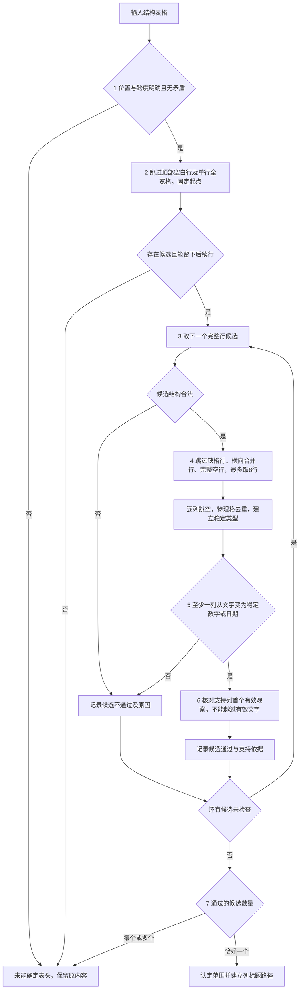

# 表头判定需求：依据、优先顺序与检验流程

更新日期：2026-09-14。对应[系统需求 T-02](../../requirements.md)、[V2.0 增量需求](../../changes/v2.0/proposal.md)与[实施清单 DES-01](../../changes/v2.0/checklist.md)。

本文按讨论确认的顺序描述表头判定，是 V2.0 的有效需求子文档。**规则和参数已经确认，但不代表代码已实现或效果已验证。**

## 1. 目标、输入与结果

对一张已经恢复单元格结构的表格，判断顶部哪些完整行共同构成列标题区域。输入包括文字、行列位置、跨度及来源。winner 和未评分的 Docling 原生表格遵守同一规则。

不识别业务分组标题、汇总、行标题或跨页续表，不使用 LLM。工具的 column_header 仅保留供核对，不单独放行、不作不确定时的回退答案。

| 最终结论 | 含义 | 下游 |
| --- | --- | --- |
| 已确定表头 | 恰好一个候选通过 | 按该范围建立多级表头路径 |
| 未能确定表头 | 输入不足、无候选通过或多个候选通过 | 保留原内容，采用行列及合并范围表达 |

未确定不等于确认没有表头，也不等于拒收表格。不得修改原文、撤销 winner 或删除未认定为表头的行。

## 2. 优先顺序与流程图

**优先级表示执行顺序和必要条件，不是加权打分。** 前置检查不通过时停止本表的表头判断；一个候选不通过时继续检查其他候选。

| 顺序 | 要回答的问题 | 依据 |
| --- | --- | --- |
| 1 | 结构能否用于判断？ | 位置、跨度明确且无矛盾 |
| 2 | 从哪行开始找？ | 跳过顶部空白行及单行全宽格，固定起点 |
| 3 | 可能在哪行结束？ | 枚举完整行范围，检查合并边界及层级 |
| 4 | 后续各列是什么类型？ | 取样、逐列跳空、物理格去重、判断稳定类型 |
| 5 | 有没有类型变化支持？ | 至少一列由候选文字变为后续稳定数字或日期 |
| 6 | 是否越过有效文字找证据？ | 从该列首个有效观察开始比较，不能挑选数字 |
| 7 | 通过范围是否唯一？ | 只有一个通过才认定 |



第六步是取证正确性核对：若第四步已保留所有有效观察并要求类型一致，第五步的支持列自然满足第六步。因此不为它虚构一个独立、不可达的失败状态，详见第八节。

## 3. 第一步：确认结构足够清楚（HD-01）

首先检查：行列数为正整数；物理格身份唯一；起止行列明确且在网格内；跨度与起止位置一致；不同物理格不重叠占位；不存在无法定位到网格的额外文字。

例如，一个格覆盖第 1—2 行，却记录跨 3 行，结构存在矛盾。出现上述问题，返回未确定，不进入候选评估。保留可用原文和来源，不为缺失信息伪造坐标。

**位置明确、文字为空的格是正常空白格。** 缺失位置与空白不同：部分网格位置缺失不立即否定整表，但包含缺失位置的候选范围不通过，包含缺失位置的后续行不能取样。

## 4. 第二步：固定寻找表头的起点（HD-02）

从顶部向下，只跳过连续的两类行：

1. 网格完整、文字全空且参与格都只跨一行的空白行，避免从跨行格中间建立起点。
2. 表格不止一列，整行恰好由一个横跨全部列、只占一行的格覆盖的全宽行。

```text
第1行：|          采购明细          |  ← 跳过寻找，但保留文字
第2行：| 产品 | 数量 | 单价 | 金额 |  ← 固定起点
第3行：| A    | 100  | 20   | 2000 |
```

遇到第一条不符合上述条件的行就固定起点。不继续到表格中间选择另一个看起来像标题的行。单列表格的普通行不因占满一列被跳过；全宽且跨多行的格也不适用单行跳过规则。

跳过不表示认定它是表名或分组标题，不删除、不向下传播其含义。全宽行可能实际是表头上层，本版保留文字但不自动纳入列标题路径，这是明确取舍。

## 5. 第三步：枚举完整候选并检查结构（HD-03）

从固定起点依次尝试一行、两行、三行等范围，至少留一行后续内容。不以最大 col_span 推断层数，不预设最多三层。

| 检查 | 通过要求 |
| --- | --- |
| 合并边界 | 开始和结束都不能从物理格中间划开 |
| 网格完整 | 候选内部没有缺失位置；位置明确的空白格允许 |
| 内部行 | 不包含完整空白行或单行全宽格 |
| 上下级关系 | 不同上下层格的列范围相交时，下层必须完全处于上层范围内，不交叉或向外扩张 |
| 列路径 | 每列能建立有序物理格路径，且区域至少有非空文字；同一跨行格只出现一次 |

```text
| 产品 |      数量      |
|      | 国内 | 海外    |
| A    | 100  | 200     |
```

“产品”跨两行，故只取第一行不成立，前两行才可能成立。“数量”包含“国内、海外”，层级不交叉。

通过这里只说明结构可以形成表头。后续比较使用每列覆盖候选最后一行的物理格，称为“最下层格”；它可以是从上层跨行延伸的格。最下层为空时，不能改取上面的非空文字。

## 6. 第四步：取样并确定后续列类型（HD-04）

### 6.1 取样行的筛选

从候选结束后，按顺序收集最多 **8 条取样行**。到表尾不足 8 行则使用已有行。

| 情况 | 处理 |
| --- | --- |
| 存在缺失网格位置 | 跳过整行，不占名额 |
| 存在横向合并格，即任一 col_span 大于 1 | 跳过整行，不占名额 |
| 完整空行，即所有覆盖格的文字都为空 | 跳过整行，不占名额 |
| 存在纵向合并格，但没有上述问题 | 可以取样，逐列按物理格去重 |
| 仅个别格为空 | 行照常取样，该列跳空，其他列正常观察 |

完整空行按实际覆盖格判断。纵向合并显示留下的“空位置”不是独立空白格；如果覆盖格有文字，不能把这一行算成全空。顶部起点还要求不穿跨行格；取样不建立新边界，因此无须套用顶部的单行跨度限制。

跳过取样不删除原文，也不认定行为汇总或分组。取样预算固定为 8 行，并纳入规则版本；该值尚未经过效果校准。

### 6.2 逐列寻找有效观察

每列在上述取样行中按顺序读取。同一个物理格只算一次；纵向合并跨五行也不能算五份证据。空格继续向下找，连续空格都跳过。占位符或无法明确分类的内容不提供类型证据，但保留记录；**有效文字不能跳过**。

```text
| 产品 | 数量 |
| A    |      |
| B    |      |
| C    | 100  |
| D    | 200  |
```

数量列跳过两个空格，用 100、200 比较；产品列正常观察。

寻找限于选出的 8 条取样行，不为某一列单独无限向下扫描。到范围末尾仍不足，只表示该列不提供支持，不否决其他列。

### 6.3 稳定类型的定义

一列至少有 **2 个不同物理格的有效观察**，且全部有效观察类型一致，才形成稳定类型：

- 100、200、300：稳定数字写法。
- 空、空、100、200：稳定数字写法。
- 100、待确认、300：类型混合，不能删掉“待确认”宣布稳定。
- 同一个跨行格 100 被三行引用：只有一次独立观察，证据不足。

类型是文字、数字写法或日期写法，不判断数字是金额、数量还是编号。最低证据量固定为 2 个独立观察，并纳入规则版本；该值不是准确率保证。具体词法见附录 A。

## 7. 第五步：至少一列提供类型变化依据（HD-05）

**本阶段唯一的支持条件：至少一列的候选最下层格为文字，该列后续为稳定数字或日期。**

| 候选最下层 → 后续稳定类型 | 是否支持 | 是否否决其他列 |
| --- | --- | --- |
| 文字 → 数字 | 是 | 否 |
| 文字 → 日期 | 是 | 否 |
| 文字 → 文字 | 否 | 否 |
| 数字 → 数字 | 否 | **否** |
| 日期 → 日期 | 否 | **否** |
| 其他组合、空白、观察不足或类型混合 | 否 | 否 |

```text
| 地区 | 销量 | 2025 |
| 华东 | 100  | 200  |
| 华南 | 300  | 400  |
```

销量列提供支持，因此本阶段通过。2025 列的数字延续不能否决该候选。

没有任何列支持则候选不通过，工具的 header 标签不能改变结果。至少一列支持只表示这一阶段通过，不单独构成最终认定。

## 8. 第六步：不能越过有效文字挑选数字（HD-06）

核对支持列：从候选之后**首个可比较的格**开始，类型应与后续稳定类型一致。可以跳过空白和非证据值，不能跳过有效文字。

```text
| 数量 | 金额 |
| 台   | 元   |
| 100  | 2000 |
| 200  | 4000 |
```

只选第一行时，“台、元”是有效文字，不允许绕过它们专看数字。选前两行时，后续首个有效值是数字，才可能提供支持。与此不同，空、空、100、200 允许跳空，不能因第一条取样行为空而否决。

实现时第四至六步可以在同一次列扫描中完成。因为第四步已要求全部有效观察类型一致，第五步的支持列自然满足本步。**本步是取证核对，不新增重复状态或独立失败原因。** “台、元”没有被跳过时，相应列已在第四步表现为类型混合。

## 9. 第七步：只认定唯一通过的范围（HD-07）

| 通过的候选数量 | 结果 |
| --- | --- |
| 0 | 未确定，保留没有支持的原因 |
| 1 | 认定该完整范围并建立列路径 |
| 大于 1 | 未确定，保留歧义候选 |

不按最短、最长、最高工具置信度或原 role 决胜，也不设计未经校准的综合分数。唯一符合规则不等于唯一真实解释。

## 10. 结果与追溯契约

保存表格 ID、规则版本、取样预算、最低独立观察数、最终结论、原因、前置跳过行及逐候选证据。内部用零基半开区间，展示用一基编号：[0,2) 即第 1—2 行。

已确定时必须有唯一范围及每列有序 cell_id 路径；未确定时不得输出猜测路径。路径包含空白格，同一跨行格只出现一次。不得修改输入 roles。

### 10.1 表级原因

HeaderDecision.outcome 仅为 identified、undetermined，含义见第 1 节。HeaderDecision.reason 全集如下，前置问题按表中顺序优先：

| reason | 触发条件 | 结论及下游 |
| --- | --- | --- |
| invalid_grid | 维度、身份、位置、跨度或重叠校验失败 | undetermined；未进入候选评估，保留可用事实 |
| unplaced_content | 网格检查通过，但有不可定位文字 | undetermined；未进入评估，保留原文 |
| no_candidate_region | 固定起点后没有可留下后续行的候选 | undetermined；未进入评估 |
| no_supported_candidate | 已评估，但没有候选通过 | undetermined；通用表达 |
| ambiguous_candidates | 至少两个候选通过 | undetermined；保留歧义，通用表达 |
| unique_supported_candidate | 恰好一个通过 | identified；使用该范围映射 |

### 10.2 候选原因与证据

HeaderCandidateEvaluation.result_reason 全集及检查顺序：

| reason | 条件 | 下游 |
| --- | --- | --- |
| structural_rejection | HD-03 任一结构条件不成立 | 不取样，继续下一候选 |
| no_type_transition | 结构通过，但没有形成支持列，包括独立观察不足 | 继续下一候选 |
| supported | 结构通过且至少一列提供合规支持 | 参与唯一性判断 |

证据不足用观察数说明，不新增与 no_type_transition 重叠的状态。没有“数字同类型延续否决”，也没有“第一条取样行为空否决”。

每个已取样候选记录：范围、各列最下层格、取样行、跳过行及原因、有序去重观察和类型、略过的非证据值、稳定类型或 null、支持列、工具标为 header 的区域内外 cell 引用。首个有效观察可由有序列表导出，不重复保存独立边界结论。

### 10.3 局部原因归属

| 归属 | code 全集及优先顺序 | 触发及影响 |
| --- | --- | --- |
| input_issues | invalid_dimensions、duplicate_cell_id、unavailable_cell_position、invalid_cell_interval、span_mismatch、overlapping_cells、unplaced_text | 分别为维度、ID、定位、区间、跨度、重叠、额外文字问题；前六项触发 invalid_grid，最后一项触发 unplaced_content |
| structural_issues | boundary_crosses_cell、missing_header_position、internal_blank_row、internal_full_width_row、crossing_column_intervals、no_nonempty_path | 分别为穿格、缺格、内部空行、单行全宽格、交叉、缺少非空路径；该候选结构不通过 |
| skipped_sample_rows | missing_position、horizontal_span、blank_row | 分别为缺格行、横向合并行、完整空行；多项命中按此顺序记录主原因，不占预算 |

原因附原行列、cell 引用和输入事实；结构问题可以同时记录多项。结构拒绝时尚未产生的取样证据留空，不伪造已执行事实。

## 11. 验收场景

下表尚未执行。认定结果以结构合法且不存在其他通过候选为前提。

| ID | 场景 | 要求 | 规则 |
| --- | --- | --- | --- |
| H01 | 文字标签下有两个独立数字格 | 提供支持，唯一时认定 | HD-04～07 |
| H02 | 文字标签列与数字年份列共存 | 文字列支持时，年份列同类型延续不否决 | HD-05 |
| H03 | 全文字，或纯数字表头配数字正文 | 没有变化支持，未确定 | HD-05 |
| H04 | 一条数据加横向合并汇总 | 汇总不凑第二条证据 | HD-04 |
| H05 | 跨两行标题格 | 只取第一行穿格，不通过 | HD-03 |
| H06 | 标签、单位、数字三段 | 不能跳过有效单位文字；完整表头才可能支持 | HD-04～06 |
| H07 | 顶部单行全宽文字 | 跳过寻找但保留，固定后续起点 | HD-02 |
| H08 | 表格中部出现像表头的行 | 不重新寻找起点 | HD-02 |
| H09 | 上下层列范围交叉 | 该候选不通过 | HD-03 |
| H10 | 同一纵向格跨三条取样行 | 只算一次观察 | HD-04 |
| H11 | 空行、横向合并行、缺格行 | 均跳过，不占 8 行名额，原因区分 | HD-04 |
| H12 | 某列为空、空、100、200 | 跳空后形成数字证据 | HD-04～06 |
| H13 | 某列为空、待确认、100、200 | 不跳有效文字，不宣布稳定数字 | HD-04～06 |
| H14 | 8 条取样行内某列全空或只有一个有效格 | 该列无支持，不否决其他列 | HD-04～05 |
| H15 | 候选空白格与缺失位置 | 空白允许，缺格拒绝候选 | HD-03 |
| H16 | 多个候选通过 | 未确定，不按深浅或 role 决胜 | HD-07 |
| H17 | 工具误标数据行为 header | 不单独放行，保留分歧 | HD-05、07 |
| H18 | 改文件名、roles、cells 容器顺序 | 按原行列恢复后最终结论稳定，诊断可反映 role 变化 | HD-01～07 |
| H19 | 无候选与候选全部失败 | 区分未进入评估与进入后无支持 | 第 10 节 |
| H20 | 无表头首行碰巧为文字，后续变数字 | 记录可能误判，不能承诺必然识别正确 | 第 12 节 |

H16 可在候选汇总层输入两个 supported 记录验证，不为测试改变前置算法。词法专项测试按附录 A 补齐。

## 12. 已知限制、验证和文档整合

### 12.1 可能判断错误的情况

本版规则只能提供表头的判断依据，不能保证识别正确。主要风险如下：

| 情况 | 为什么会出问题 | 可能结果 |
| --- | --- | --- |
| 无表头的数据首行是文字，后续是数字 | 数据本身也可能出现类型变化，例如“待确认、100、200” | 把数据行误认成表头 |
| 真表头下面第一条数据含“待确认”等文字 | 只取真表头时类型混杂，多取一行反而出现稳定数字 | 把第一条数据也纳入表头，形成错误字段名 |
| 多级表头的下层是年份、数字编号等 | 数字下层与正文类型一致，只取上层可能通过 | 表头少取一层，丢失年份等限定 |
| 顶部全宽格实际是上层标题或单位 | 本版会跳过它，不加入列标题路径 | 原文保留，但拆分后可能缺少单位或上层含义 |
| 全文本文字表格、纯数字表头，或只有一条数据 | 没有类型变化，或不足两份独立观察 | 有真实表头也返回未确定 |
| 数据稀疏或类型混杂 | 8条取样行内有效值不足，或文字、数字混合 | 无法形成支持；整行全空不占预算，但部分空白行占预算 |
| 多个候选范围都通过 | 不同列可能分别支持不同范围 | 返回未确定，不强行选择最长或最短 |
| 取样跨过全宽行等内容，或真实表头结构复杂 | 后续证据可能来自另一段；真实表头也可能不符合树状层级要求 | 误认、范围错误或未确定 |
| 数字/日期格式未覆盖，或上游已漏字、串列、合并错误 | 类型分类和结构校验不能恢复缺失事实 | 可能误认或漏判，需要先定位问题来源 |

前三类会产生错误字段含义，通常比“未确定后使用行列表达”更值得优先检查。**原文没有删除，不代表语义没有被错误表达。** 上述情况是规则推演，不是已经测得的发生率。

### 12.2 后续从哪里优化

保留四个明确的调整位置：

- **候选范围**：改善起点、结束位置和多层表头判断。
- **取样规则**：评估8行预算、稀疏数据及跨区域取证问题。
- **类型与支持依据**：完善数字/日期格式，研究纯文本和混合类型表格。
- **候选选择**：研究多个范围都通过时，是否有可靠依据进一步区分。

这些是后续优化方向，不是本版新增规则。调整前先保存失败样例，避免针对某份合同或特定关键词写特例；如果原始结构已错，应优先修复提取或归一化。

### 12.3 如何验证和记录

每个问题样例保留：原表来源、单元格结构、规则版本与参数、判定依据、人工确认的表头范围，以及错误发生在哪一步。无法提供原 PDF 时，可保留脱敏网格，但应说明缺少原始视觉证据。

验证分别统计：

- 正确认定表头，且范围和列路径正确。
- 误认表头或表头范围、路径错误。
- 有真实表头，但返回未确定。

人工也无法判断的样例单列。使用现有14个 winner、通用边界样例和新增独立样本；每次优化既检查目标问题是否改善，也检查是否引入新的误判，不能只看认定的表格变多。

本节的例子是需求验证场景，不代表本规则已经运行或通过验证。本节随 V2.0 需求一并维护；具体实现和效果验证仍由 TXT-01/TXT-06 完成。RAG 的表头判定及验收不依赖实验调研文档或输出。

## 附录 A：类型分类规则

分类只操作分析副本：先做 Unicode NFKC 规范化，去除首尾空白并把连续空白折叠为一个空格；所有类型都必须整串匹配。原文不被修改，也不能抽取局部数字来代表整个单元格。

| CellShape.shape | 条件 | 是否有效观察 |
| --- | --- | --- |
| empty | 规范化后为空串 | 否，可继续向下找 |
| date_shape | 整格符合下述日期写法 | 是 |
| number_shape | 整格符合下述数字写法 | 是 |
| text_shape | 其余所有非空内容 | 是 |

只有 `empty` 可以在逐列取样时跳过。`-`、`N/A`、`待确认` 等非空占位内容均归为 `text_shape`，必须参与类型稳定性判断，不能为了得到稳定数字或日期而跳过。

分类优先级为 `empty` → `date_shape` → `number_shape` → `text_shape`。日期先于数字，因此 `25.09.25` 按日期处理，不产生“歧义”类型。

日期只接受以下外形，其中 `M`、`D` 可为一位或两位，`YY` 为两位、`YYYY` 为四位；同时校验月份 1—12 和日期 1—31，不推断地区顺序、世纪或真实日历有效性：

- `YYYY-M-D`、`YYYY/M/D`
- `D/M/YYYY` 或 `M/D/YYYY` 所共有的 `A/B/YYYY` 外形
- `D.M.YY`、`D.M.YYYY`

数字接受 Unicode 十进制数字，可带一个前置正负号或用一对圆括号表示负数。`.`、`,`、`'`、`‘`、`’`、`ʼ`、`´` 或空格只允许出现在两个数字之间，且不能连续出现。可选货币只能是一个 `$`、`€`、`£`、`¥` 符号，或在数值前后以空格分隔的三个 ASCII 大写字母代码；可选 `%` 只能位于数值末尾，不能和货币同时使用。

因此 `USD 96.80`、`2024` 是 `number_shape`，`25.09.25` 是 `date_shape`，`HXE12ES`、`N/A` 是 `text_shape`。

本版规则标识固定为 `table_header_v1`，`sample_row_limit=8`，`min_stable_observations=2`。这些值及上述词法都参与构建配置兼容性检查；任何调整都必须变更规则版本并重建 v2 索引。实现和样本效果仍须按第 11、12 节验证。
